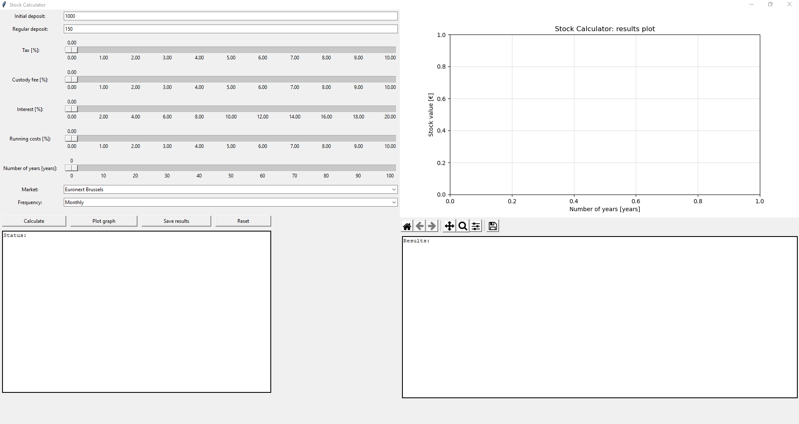
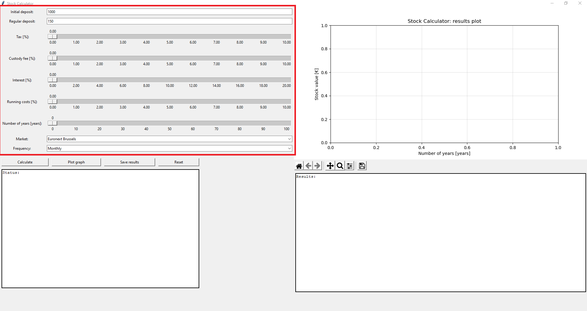
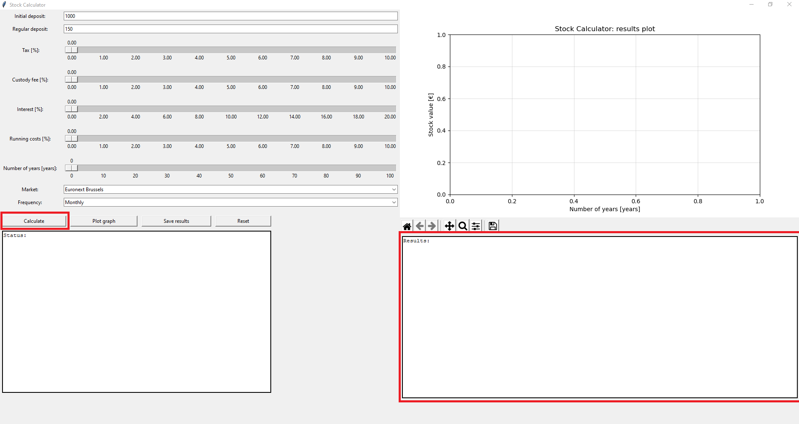
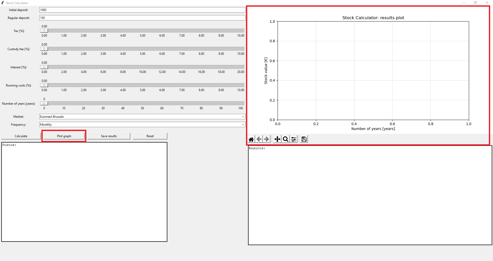
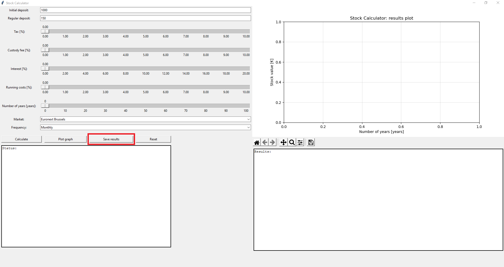
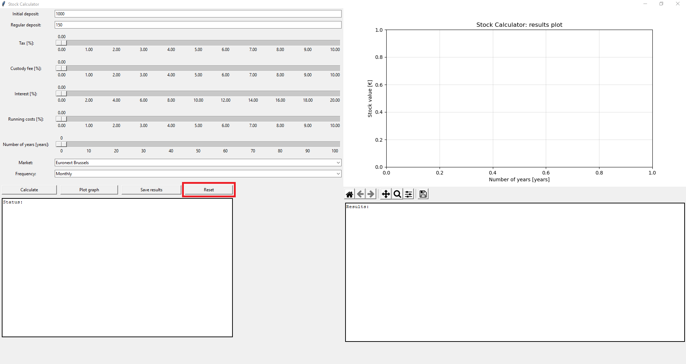
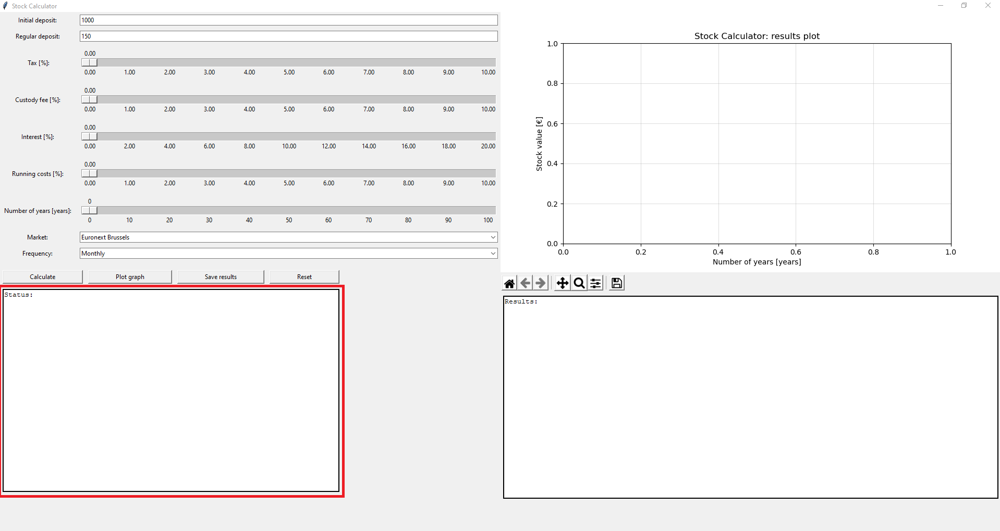

# Stock Calculator: contents
GUI application to calculate the accumulated value of stocks.
- [Overview](#overview)
- [Usage](#usage)
- [How it works](#how-it-works)
- [Known limitations](#known-limitations)
- [Dependencies](#dependencies)

## Overview
Investing a fixed amount of money every month over a prolonged period of time allows money to accumulate exponentially.
This principle is known as compound interest (read more: [Compound interest Wikipedia](https://en.wikipedia.org/wiki/Compound_interest)).

The aim of this basic GUI is to calculate the accumulated sum given an initial deposit value, regular deposit value and multiple relevant parameters.
Most online calculators provide only a very rough estimate of the accumulated value but mostly fail to factor in (hidden) costs. 

## Usage 
To start the GUI:
>`cd < place where python script is stored > `
>`python StockCalculator.pyw `

Example usage: 
1. Set the parameters of choice. 

2. Calculate the results via the calculate button.   Results will appear in the results textbox.

3. Make a plot via the plot button.

4. Save your current configuration and their results to a file via the save button.

5. Reset the interface to default values via the reset button.

If anything were to go wrong during execution, an appropriate message will pop up and this message will remain in the status textbox.

## How it works
### Maths
- Basics: 
Compound interest is expressed as: 
$$ A = P (1 + \frac{r}{n})^{nt}$$ 
Where: 
	- total amount A
	- initial amount P
	- interest rate r
	- compounds per year n
	- time t
(Example [compound interest](https://www.thecalculatorsite.com/articles/finance/compound-interest-formula.php))

For our equation, this formula can be simplified to the form: 
$$ A = P (1 + r)^{t} $$.

- Accumulation: 
The basic compound interest formula is only valid if only one initial deposit is made.

- Added complexity:

### Example
If:  
- Initial deposit = 1000
- Regular deposit = 500
- Number of years invested = 2
- Interest = 5%
- Running costs = 1% 
- Custody fee = 2% 
- Frequency = 2 deposits per year (January and July )

<b> First year: </b>
$$ deposit_{initial} = 1000 * (1 + 0.05) = 1050 $$
$$ deposit_1 = 500 * (1 + 0.05*((12-0)/12)) = 525 $$
$$ deposit_2 = 500 * (1 + 0.05*((12-6)/12)) = 512.5 $$
$$ sum  = 525 + 512.5 + 1050 = 2087.5 $$
$$ runningcosts = 2087.3475 * 0.01 = 20.875 $$
$$ custodyfee = (sum - runningcosts) * 0.02 = 41.3325 $$
$$ sum_{1 year} = 2025.2925 $$
 
<b> Second year:</b>
$$ sum = sum_{1_year} * (1 + 0.05) + 1037.5 = 2126.40 + 1037.5  = 3164.06 $$
$$ runningcosts = 31.64 $$
$$ custodyfee = (sum - runningcosts) * 0.02 = 62.64 $$
$$ sum_{2 year} = 3069.77 $$ 
$$ sum_{deposits} = 1000 + 2 * 500 + 2 * 500 = 3000 $$
$$ profit = 3069.77 - 3000 - taxes^ - brokeragefee^* $$
Taxes depending on chosen market and stock type.
Brokerage fee depending on chosen market.

### Known limitations
* Tkinter
* Exactness
* Brokerage fee

### Dependencies
The program mostly uses the Python standard library, only the matplotlib and numpy packages are necessary.

To check if the packages are installed on your system:
> `pip list` 

To install dependencies if the required packages are not present:
> `pip install matplotlib && pip install numpy` 
